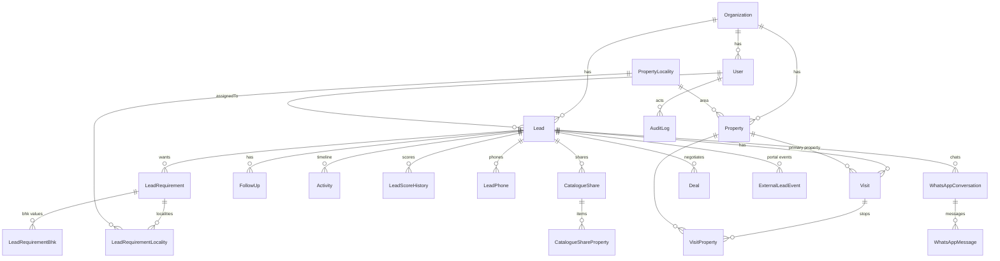

# Database

PostgreSQL, accessed only through Prisma 6. Schema: `prisma/schema.prisma` (65 models, 95 enums). Local: Docker `postgres:16-alpine`; production: `postgres:17`. This document explains the model; read the schema for exact columns.

> The root `README.md` still says SQLite. That is historical. The datasource is `postgresql` and `prisma/migrations.sqlite-archive/` is archival only.

## Core entities

| Entity | Role |
|---|---|
| **Organization** | Tenant. Holds `settings` JSON, timezone `Asia/Kolkata`, currency `INR`. One row today: `org_default`. |
| **User** | Login and "Employee" in one table. `role` (`ADMIN/DATA_MANAGER/FIELD_EXECUTIVE`), `status`, capacity (`maxActiveLeads`), `speciality`, `isAvailable`, `autoAssignEnabled`, `authVersion` (bumped to revoke sessions), `passwordHash`. Related: `EmployeeServiceArea`, `AccountSetupToken`, `PasswordResetToken`. |
| **Lead** | Client enquiry. `leadCode` (unique, human), `source` (`LeadSource`: includes `OLX`), `status`, `priority`, `assignedToId`, top-level preferences (`preferredLocation`, `minBudget/maxBudget`, **nullable** `preferredBhk`), commercial fields, `externalLeadId` (unique webhook dedupe key). `LeadPhone` holds multiple numbers with a primary. |
| **LeadRequirement** (+ `LeadRequirementBhk`, `LeadRequirementLocality`) | Structured requirement: `assetClass`, `transactionType`, budget/area ranges, lift/parking preferences, `status` (`ACTIVE/PAUSED/FULFILLED/CANCELLED`). Many BHK values and many localities per requirement. |
| **Property** | Inventory. `propertyCode` (unique), `assetClass`, `listingType`, `propertyType`, `status` (`AVAILABLE/RESERVED/RENTED/SOLD/INACTIVE`), non-null `bhk`, pricing for rent and sale, owner/partner links, GPS, verification. `PropertyLocality` is the normalised locality dictionary (+ aliases). `PropertyImage`, `PropertyTimelineEvent`, `PropertyAvailabilityReport`, `PropertyReport`, `PropertyFavorite`, `PropertyViewLog` hang off it. |
| **Visit** | A viewing: `leadId`, `propertyId` (the first/primary property, kept for compatibility), `assignedToId`, `visitDate` + `visitTime` (IST string), `status`, `outcome`, notes. |
| **VisitProperty** | The authoritative per-property rows of a visit: `sequence`, `status` (`PENDING/VISITED/SKIPPED/CLIENT_REJECTED/UNAVAILABLE`), `reactionRating` 1–5, `isPreferred`. Unique on `(visitId, propertyId)`. Code that asks "does this visit include property X" must check **both** `Visit.propertyId` and `VisitProperty` (see `property-access.ts`). |
| **VisitFeedback** | Post-visit feedback per completed visit. |
| **FollowUp** | `type`, `dueAt`, `status` (`PENDING/COMPLETED/RESCHEDULED/OVERDUE`), assignee. |
| **Activity** | Per-lead timeline entries (`ActivityType`). Written by `logActivity`. |
| **AuditLog** | `action` (`CREATE/UPDATE/DELETE/LOGIN/LOGOUT/EXPORT/IMPORT/OTHER`), `entityType`, `entityId`, redacted `oldValues/newValues` JSON, `result`. Written by `recordAudit`. |
| **Notification** | In-app alerts per user (`NotificationType`). |
| **LeadScoreHistory** | Every score recalculation with its factor breakdown. |
| **LeadAssignmentRule**, **LeadAssignmentHistory**, **LeadTransfer** | Auto-assignment config and the assignment trail. |
| **WhatsAppConversation / WhatsAppMessage** | Per-lead (or inbox) threads; message `direction`, `status` (`QUEUED→SENT→DELIVERED→READ` or `FAILED`). |
| **CatalogueShare / CatalogueShareProperty / CatalogueInteraction / CataloguePropertyPreference / CatalogueVersionEvent** | Public share links, items, client reactions, change history. `SharedPropertyLog` is the older quick-share log. |
| **IntegrationWebhookEvent** | WhatsApp webhook idempotency (unique `provider` + `externalEventId`). |
| **PropertyPortalConnection / PortalListing / PortalOperation / ExternalLeadEvent** | Portal integrations: connections, mapped listings, retryable operations, inbound lead events with a sanitised snapshot. |
| **Owner, InventoryPartner, Deal, DealOffer, BrokerageCalculation, Payment, Document** | Owners/partners, negotiation, money, and file metadata (bytes live in object storage). |
| **ImportJob / ImportRecord / ImportMappingPreset** | Spreadsheet and Housing-file imports with rollback. |
| **SavedView, SystemConfig, AutomationRule, BackupRecord, RestoreValidation** | Settings, saved filters, automation, backup metadata. |
| **CustomerContact / CustomerRequirement / PropertyRecommendation** | Retired "Demand Pool". Tables stay for legacy data; UI and APIs are retired. |

## Organization (tenant) scoping

- Almost every table has `organizationId`, defaulting to `"org_default"` at the DB level.
- Interactive requests get the org from the session: `getOrganizationId(session.user)` in `src/lib/organization.ts`, which **throws instead of falling back**. Never accept an org id from a query string, body or URL.
- Trusted non-interactive contexts (seeds, webhooks) use `DEFAULT_ORGANIZATION_ID` or a server env (`ACRES_99_ORGANIZATION_ID`, `HOUSING_ORGANIZATION_ID`).
- Every query you write must include `organizationId` in its `where`. `*-org-isolation.test.ts` files exist to catch regressions.

## IDs and public IDs

- Primary keys are `cuid()` strings. They are opaque and are not shown to users.
- Human-readable codes: `Lead.leadCode` (`generateCode("LEAD", n)`) and `Property.propertyCode`, both unique. Demo rows use `KP-DEMO-…` codes and `kp-demo-…` ids.
- Public sharing never uses database ids: catalogue links use a 192-bit random token (`crypto.randomBytes(24)`, base64url). The public property page `/p/[id]` renders through a whitelist DTO.

## Important enums

`Role`, `LeadStatus`, `LeadPriority`, `LeadSource` (`ACRES_99, MAGICBRICKS, HOUSING_COM, WEBSITE, WHATSAPP, PHONE_CALL, REFERRAL, WALK_IN, MANUAL, OLX, SQUARE_CONNECT, DIRECT, OTHER, META`), `AssetClass` (`RESIDENTIAL/COMMERCIAL`), `TransactionType`/`ListingType`/`RequirementType` (rent/sale/buy flavours: they are distinct enums, mind which one a model uses), `PropertyType`, `PropertyStatus`, `VisitStatus`, `VisitPropertyStatus`, `VisitOutcome`, `FollowUpType/Status`, `DealStage/Status`, `AssignmentStrategy` (`ROUND_ROBIN, LOWEST_WORKLOAD, LOCATION_BASED, SPECIALITY, MANUAL_ONLY`), `WhatsAppProviderName/MessageStatus`, `PropertyPortalProvider`. **Postgres enum values can be added but not cheaply removed**; additions go through a migration (`ALTER TYPE … ADD VALUE`).

## Cascade / restrict behaviour

- Child rows of a lead (requirements, visits, follow-ups, activities, score history, shares) use `onDelete: Cascade`: deleting a lead deletes its history. The app soft-deactivates properties (`status = INACTIVE`) rather than deleting them.
- Conversations use `SetNull` on lead and assignee so message history survives.
- `LeadRequirementLocality.locality` is the one `Restrict`: a locality in use by a requirement cannot be deleted.
- Because deletes cascade, **never delete leads or properties casually in any shared database.** See [PRODUCTION_SAFETY.md](PRODUCTION_SAFETY.md).

## ⚠️ BHK, 1 RK, and commercial properties

- `Property.bhk` is a non-null `Int`. **`bhk = 0` on a `RESIDENTIAL` property means 1 RK.**
- **Commercial properties also store `bhk = 0` internally.** They must *never* render as 1 RK or "0 BHK". Distinguish by `assetClass`/`propertyType`, never by `bhk` alone.
- `Lead.preferredBhk`, `CustomerRequirement.bhk` and parsed filter values are **nullable**. Zero is a legitimate value, so **never use truthiness** (`if (bhk)`, `bhk || x`, `bhk ? … : …`). Use `bhk !== null` / `bhk != null` / `Number.isInteger`.
- Always render through the shared formatters in `src/lib/property-categories.ts`: `residentialConfigurationLabel(bhk)` (`0 → "1 RK"`, else `"N BHK"`) and `propertySpecSummary(property)` (commercial → its type label, plot → "Plot").
- Always parse list filters with `parsePropertyBhkFilter` / `resolvePropertyListBhkFilter` (`src/lib/property-list-filters.ts`). An unscoped BHK query is forced to `RESIDENTIAL` so commercial rows with `bhk = 0` cannot leak into a 1 RK search; an explicit `COMMERCIAL` category ignores BHK.
- Matching uses the same labels and treats the commercial path separately (`commercial-matching.test.ts`, `matching-business-lines.test.ts`).

## Migrations

- Location: `prisma/migrations/<timestamp>_<name>/migration.sql` (36 today) + `migration_lock.toml` (`postgresql`).
- Local/dev workflow for a schema change: edit `schema.prisma`, then `npx prisma migrate dev --name <short_name>` against **your local** database, commit the generated folder together with the schema change. Details in [DEVELOPMENT_WORKFLOW.md](DEVELOPMENT_WORKFLOW.md).
- Apply existing migrations (fresh clone, or after pulling): `npx prisma migrate deploy`. Check state: `npx prisma migrate status`.
- Production applies migrations with `migrate deploy` only, after a backup (see [DEPLOYMENT_OVERVIEW.md](DEPLOYMENT_OVERVIEW.md)). **Never** `migrate reset` or `db push` against production.
- `prisma/manual-migrations/*.sql` are historical hand-run scripts from before migrations were tracked. They are *not* applied by Prisma and you should not run them. A fresh database replays the tracked chain cleanly (verified on an empty database). `prisma/ci/legacy-schema-bootstrap.sql` is a CI-only workaround for old drift, and is not needed for local setup.

## Seeding

| Command | What | Safe? |
|---|---|---|
| `npm run seed:demo` | Realistic fake dataset (`KP-DEMO-`, `@kpproperties.demo`, password `DemoPass@123`). Guarded: refuses non-local hosts and known production hosts unless explicit overrides are set. Idempotent. | Local only. Never set the production override variables |
| `npm run seed:demo:dry-run` / `seed:demo:verify` | Plan preview / status check. | Read-only |
| `npm run seed:remove` | Removes demo rows (requires `DEMO_REMOVE_CONFIRMATION`). | Local |
| `npm run db:seed` | Legacy 5-user seed with well-known passwords. | Local only |
| `npm run test:e2e:seed` | 4 synthetic QA identities. Refuses non-local DBs. | Local QA DB |
| `npm run bootstrap:production` | Creates the first real admin. | Production ops, not for you |
| `npm run handover:reset:*` | Destructive "reset for handover" tooling with dry-run/execute modes. | **Never run.** See [PRODUCTION_SAFETY.md](PRODUCTION_SAFETY.md) |

Next: [FEATURES.md](FEATURES.md).
