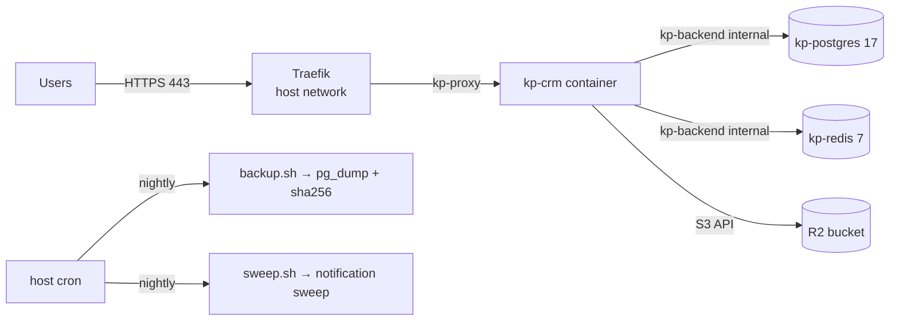

# Deployment Overview (informational)

This describes how production is deployed so you understand what your code ends up running on. **It contains no credentials and you are not expected to deploy.** Production deploys are performed by the owner on the server. The authoritative runbook is `deploy/README.md`; this is the high-level view.

## Production architecture

- **Domain:** `crm.kpproperties.co.in`
- **Host:** one Linux VPS (Hostinger) running Docker Compose, project `kp-crm` (`docker-compose.prod.yml`).
- **Containers:**
  - `kp-crm`: the Next.js app (image `kp-crm:<tag>`, Node 22 slim, `output: standalone`, non-root user, port 3000, memory-limited)
  - `kp-postgres`: PostgreSQL 17, data in the named volume `kp_pgdata`
  - `kp-redis`: Redis 7 with a password, 128 MB LRU, AOF persistence, volume `kp_redisdata`
- **Edge:** an **existing Traefik** (host network, ports 80/443, managed outside this repo) terminates TLS (Let's Encrypt) and routes `Host(<CRM_DOMAIN>)` to `kp-crm` via labels on the container.
- **Networks:** `kp-proxy` (Traefik ↔ CRM) and `kp-backend`, which is `internal: true`. Postgres and Redis publish **no host ports** and are reachable only from the app container.
- **Object storage:** Cloudflare R2 (private bucket, presigned URLs).
- **Server layout:** `/opt/kp-crm/{repo,env,backups,scripts}`. The code is a Git checkout in `repo/`; secrets are in `env/.env.production` (mode 600), **outside the repository**.

## Build and release flow (as the owner runs it)

1. **Merge to `main`** after the gates pass.
2. **Back up first.** `backup.sh` takes a custom-format `pg_dump`, verifies it is listable (`pg_restore -l`) and writes a SHA-256 checksum. Retention: 7 daily / 4 weekly / 6 monthly under `/opt/kp-crm/backups`.
3. **Update the checkout:** `git pull --ff-only` in `/opt/kp-crm/repo`.
4. **Tag the working image** (for example `kp-crm:prev`) so there is something to roll back to.
5. **Build the image:** `deploy.sh build` → `docker compose build crm` using the multi-stage `Dockerfile` (deps → build → runner). `NEXT_PUBLIC_*` values and the non-secret R2 values used by the Content-Security-Policy are **baked in at build time**, so a hostname or bucket change needs a rebuild.
6. **Check migrations:** `deploy.sh migrate-status` builds a one-off `migrate` image target and runs `prisma migrate status` against the production database over the internal network. If a reviewed migration is pending, `deploy.sh migrate-deploy` applies it with `prisma migrate deploy`. Only that command; never `db push` or `migrate reset`.
7. **Roll out:** `deploy.sh up` (`docker compose up -d`). Compose starts `crm` only after Postgres and Redis report healthy.
8. **Verify:** the container healthcheck polls `GET /api/health` (`{"status":"ok"}`) every 30 s; then a manual smoke test (login, a lead, a property).

## Health checking

- App: `/api/health` (liveness) is public; `/api/system/health` and `/api/system/readiness` are also public probes.
- Compose healthchecks exist for Postgres (`pg_isready`), Redis (`PING`) and the app; the Dockerfile has its own `HEALTHCHECK`.

## Rollback

- **Code/image:** start the previously tagged image: `CRM_IMAGE_TAG=<previous tag> docker compose -f docker-compose.prod.yml --env-file <env file> up -d --no-build crm`.
- **If a migration ran** and data must go back, restore the pre-deploy dump with `restore.sh` (it verifies the checksum and recreates the target database). Data written after the backup is lost, which is why migrations are kept additive and reviewed beforehand.

## Environment file

`/opt/kp-crm/env/.env.production` is created on the server from `.env.production.template` by `deploy/scripts/02-gen-env.sh`, which generates the database/Redis/cron/auth secrets locally on the server. Provider secrets (R2 keys, 99acres secret, WhatsApp) are entered there privately. It is never committed, never pasted into chat, never copied to laptops. See [ENVIRONMENT.md](ENVIRONMENT.md).

## Scheduled jobs

Host cron (installed by `03-install-cron.sh`): nightly backup at 02:00 UTC and notification sweep at 03:00 UTC. The sweep only creates in-app notifications; it never sends WhatsApp.

## CI

`.github/workflows/ci.yml` runs on pull requests and pushes to `main`: `prisma validate`, `generate`, migrate on an ephemeral Postgres, `tsc --noEmit`, `eslint`, `vitest run`, and `next build`. CI does **not** deploy.

## Legacy

`vercel.json` and the Supabase-style `DATABASE_URL` comments in `.env.example` reflect an earlier Vercel + Supabase hosting. Current production is the VPS above. Don't assume Vercel-only behaviour.

## What you do not need

SSH access, server paths beyond what is described here, database passwords, Traefik configuration, R2 keys, webhook secrets. If you think you need one, stop and read [PRODUCTION_SAFETY.md](PRODUCTION_SAFETY.md).

Next: [PRODUCTION_SAFETY.md](PRODUCTION_SAFETY.md).
