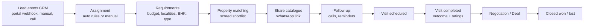

# Project Overview

## What problem this solves

KP Properties is a Delhi real-estate brokerage. Before this CRM, leads arrived from portals (99acres, Housing.com, OLX, MagicBricks), calls, walk-ins and referrals; inventory lived in spreadsheets and chats; and nobody could easily say *which lead was promised which property, who was visiting what today, and who needed a call back*.

The CRM is the single place where a small team of admins, data managers (call-centre style) and field executives can:

- capture every lead once, de-duplicated, with its source;
- record what the client actually wants (requirements);
- match those needs against available inventory with a transparent score;
- share a shortlist with the client over WhatsApp via a no-login catalogue link;
- schedule, run and complete property visits;
- never lose a follow-up;
- see conversion, workload and inventory health.

It is single-company software today (one organization, `org_default`), but every table carries an `organizationId` so multi-tenant use is possible — see [DATABASE.md](DATABASE.md).

## The lead lifecycle

Lead statuses (`LeadStatus` enum) in pipeline order: `NEW → CONTACTED → QUALIFIED → PROPERTIES_SHARED → VISIT_SCHEDULED → VISIT_COMPLETED → NEGOTIATION → CLOSED_WON`, with the exits `CLOSED_LOST`, `NOT_INTERESTED`, `INVALID`.

Step by step:

1. **Lead enters.** Created manually (`/leads/new`), imported, or pushed by a portal webhook (99acres, Housing). Webhook leads are de-duplicated by an external id or a fingerprint. Creation logs an activity, scores the lead, may auto-assign it and notifies staff.
2. **Assignment.** Rules in *Settings → Automatic Lead Assignment* choose an employee (round robin, lowest workload, location, speciality, or manual-only). An admin can also assign or transfer by hand; every change is kept in the history.
3. **Requirements.** A lead can have structured requirements (residential or commercial, localities, several BHK values, budget, area, lift/parking preferences). An **ACTIVE** requirement overrides the lead's own top-level preference fields during matching.
4. **Matching.** The engine scores available properties against the lead (location, budget, BHK, furnishing, availability, type) and explains each score with human-readable reasons.
5. **Follow-up.** Follow-ups (call, WhatsApp, property sharing, visit confirmation…) have due dates and surface in the daily work view and as notifications when due or overdue.
6. **Visit.** Scheduling a visit moves the lead to `VISIT_SCHEDULED`. A visit can cover several properties (`VisitProperty`), each rated individually.
7. **Visit completion.** Completing the visit records outcomes and moves the lead to `VISIT_COMPLETED`. A lead **cannot** be moved to Visit Completed without a visit behind it — see below.
8. **Negotiation and closure.** Deals track stage, offers, brokerage and payments; the lead ends `CLOSED_WON` or `CLOSED_LOST`.

## Concepts and vocabulary

| Term | Meaning in this codebase |
|---|---|
| **Organization** | The tenant. Everything is scoped by `organizationId`. Today there is one, `org_default`. |
| **User / Employee** | Same table (`User`). "Employee" is the UI word. Roles: `ADMIN`, `DATA_MANAGER`, `FIELD_EXECUTIVE`. |
| **Lead** | A prospective client. Has a human-readable `leadCode`, a phone (multiple via `LeadPhone`), a source, a status, a priority. |
| **Contact / customer details** | Name, phone(s), email on the Lead. The older "Customer / Demand Pool" module (`CustomerContact`, `CustomerRequirement`) is **retired**: `/customers` redirects to `/leads` and its APIs return `410`. Tables remain for legacy data. |
| **Requirement** | `LeadRequirement`: what the client wants. Residential or commercial, rent or sale. |
| **Property** | An inventory unit (`Property`, human code `propertyCode`). |
| **Residential vs commercial** | `assetClass` = `RESIDENTIAL` or `COMMERCIAL`. Commercial rows (shop, office, showroom, warehouse…) have their own fields and matching rules. |
| **1 RK** | A residential unit with no separate bedroom. Stored as **`bhk = 0`**. Rendered "1 RK", never "0 BHK". Commercial rows also store `bhk = 0` internally and must **never** render as 1 RK. See [DATABASE.md](DATABASE.md). |
| **Matching** | Scoring properties against a lead (and the reverse: which leads suit a new property). `src/lib/matching.ts`, `lead-matching.ts`. |
| **Hot / Warm / Cold** | `LeadPriority`, derived from a 0–100 lead score (`src/lib/scoring.ts`). |
| **Catalogue** | A curated set of properties shared with a client through a public token link (`/share/catalogue/[token]`). Tracks views, interest, visit requests. |
| **Visit** | A scheduled property viewing for a lead, assigned to an employee. Statuses: `SCHEDULED, CONFIRMED, CLIENT_REACHED, EMPLOYEE_REACHED, IN_PROGRESS, COMPLETED, RESCHEDULED, CANCELLED, CLIENT_NO_SHOW`. |
| **VisitProperty** | One property inside a (possibly multi-property) visit, with status, 1–5 star reaction and "preferred" flag. |
| **Completed Visit** | A visit with status `COMPLETED`. The **Visits → Completed** tab lists them. |
| **Follow-up** | A due-dated task on a lead (`FollowUp`). Types include `PHONE_CALL, WHATSAPP, PROPERTY_SHARING, VISIT_CONFIRMATION, NEGOTIATION, DOCUMENTATION, PAYMENT_REMINDER, GENERAL_FOLLOW_UP`. |
| **Activity** | The per-lead timeline (`Activity`): status changes, notes, shares, visits, WhatsApp events. Human-facing history. |
| **Audit log** | `AuditLog`: who changed what (create/update/delete/login/export…), with sensitive fields redacted. Compliance-facing history, separate from Activity. |
| **Notification** | In-app alert (`Notification`) for a user: due follow-ups, hot leads, catalogue opened, etc. Nothing is sent outside the app by notifications. |
| **Deal** | Negotiation record with stage (`INQUIRY → NEGOTIATION → AGREEMENT → TOKEN_RECEIVED → DOCUMENTATION → REGISTRATION → CLOSED_WON/LOST`), offers, brokerage calculation and payments. |
| **Owner / Inventory partner** | Property owners, and other brokers who supply inventory. |
| **Portal** | An external listing site (99acres, Housing, OLX, MagicBricks, Meta…) that delivers leads. |
| **Provider** | In WhatsApp/maps/storage: the pluggable implementation selected by an env var (`WHATSAPP_PROVIDER`, `MAPS_PROVIDER`, `STORAGE_PROVIDER`). |

## Recently added behaviours worth knowing

### Visit Completed requires a visit

A lead should not show "Visit Completed" unless a visit actually happened. Moving a lead to `VISIT_COMPLETED`:

- **If an active visit exists** (status `SCHEDULED, CONFIRMED, CLIENT_REACHED, EMPLOYEE_REACHED` or `IN_PROGRESS`): the newest one is marked `COMPLETED` and the lead moves.
- **If no visit exists:** the API answers `409` with code `VISIT_REQUIRED`. The lead page snaps the status dropdown back and opens the **"No visit on record"** dialog. The user picks the property, the employee and the date/time; submitting calls `POST /api/leads/[id]/completed-visit`, which creates one `COMPLETED` visit **and** moves the lead to `VISIT_COMPLETED` in one database transaction. It sends no WhatsApp, email or webhook.

Why: it keeps the Completed Visits tab, visit-based reports and lead scoring honest, and removes the old way of reaching "Visit Completed" with nothing behind it.

### 1 RK and OLX

`bhk = 0` on a residential property now consistently means **1 RK** across the Properties filter, list/detail/catalogue labels, WhatsApp copy and matching. Filters use `!== null` rather than truthiness so `0` is not dropped. `OLX` is available as a lead source in forms, filters, assignment rules and scoring.

## Who uses it

| Role | Typical day |
|---|---|
| **Admin** | Everything: inventory, employees, reports, settings, integrations, deals. |
| **Data manager** | Works the lead queue by phone/WhatsApp, records requirements, shares catalogues, schedules visits. |
| **Field executive** | On the road: sees only their assigned (and unassigned) leads and their visits; runs visits, captures property GPS, records outcomes. |

Details: [ROLES_AND_PERMISSIONS.md](ROLES_AND_PERMISSIONS.md).

## Where things stand

See [FEATURE_STATUS.md](FEATURE_STATUS.md). Next: [ARCHITECTURE.md](ARCHITECTURE.md).
