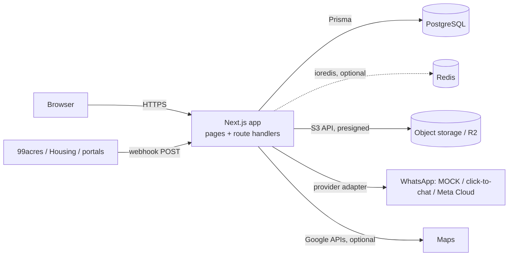

# KP Properties CRM — Developer Onboarding

Start here. This folder takes a developer on a fresh Mac from `git clone` to a running local CRM with fake demo data, and explains how the system works well enough to make changes safely.

> **Production is live** at `https://crm.kpproperties.co.in` and holds real customer data. `main` is the source of truth for what is deployed. Nothing in this onboarding requires, or should ever involve, production credentials or the production database. Read [PRODUCTION_SAFETY.md](PRODUCTION_SAFETY.md) before you run any script you did not write.

## What the CRM is

A multi-role CRM and property-inventory platform for **KP Properties**, a Delhi real-estate brokerage. Staff capture leads (manually and from property portals), record what each client wants, match those requirements against the inventory, share shortlists over WhatsApp, schedule and complete property visits, follow up, negotiate and close.

## Technology stack (verified from `package.json`, `Dockerfile`, `prisma/schema.prisma`)

| Layer | Technology |
|---|---|
| Framework | Next.js **16.2** (App Router), React 19, TypeScript. `dev`/`build` are pinned to `--webpack` |
| Styling / UI | Tailwind CSS 4, `lucide-react`, `sonner` toasts, `recharts` charts |
| Forms / validation | `react-hook-form` + `zod` |
| Auth | Auth.js (`next-auth` v5 beta), Credentials provider, JWT sessions, `bcryptjs` |
| Database | **PostgreSQL** via **Prisma 6** (`prisma/schema.prisma`, 65 models, 95 enums, 36 migrations) |
| Cache / rate limit | Redis via `ioredis` (optional locally; fails open) |
| File storage | Cloudflare R2 in production (S3 API); `DISABLED` locally |
| Errors | `@sentry/nextjs` |
| Unit tests | Vitest (283 files, 3043 tests at time of writing) |
| E2E tests | Playwright (Chromium), local-only safety-guarded |
| Production runtime | Docker (Node 22 slim, Next `standalone` output) + Postgres 17 + Redis 7 behind Traefik on a VPS |

## Architecture in one picture



Details: [ARCHITECTURE.md](ARCHITECTURE.md).

## Main modules

Leads · Properties (residential + commercial) · Lead requirements · Property matching · Catalogues (public share links) · Visits and Completed Visits · Follow-ups · Lead scoring and auto-assignment · Notifications · Activity timeline and audit log · Reports and dashboards · WhatsApp · Property-portal integrations (99acres, Housing, others) · Owners, Deals, Documents · Settings and automation rules. Feature-by-feature map: [FEATURES.md](FEATURES.md); status of each: [FEATURE_STATUS.md](FEATURE_STATUS.md).

## Recommended reading order

| # | Document | Read it to… |
|---|---|---|
| 1 | [PROJECT_OVERVIEW.md](PROJECT_OVERVIEW.md) | understand the business and the vocabulary |
| 2 | [ARCHITECTURE.md](ARCHITECTURE.md) | know where code lives and why |
| 3 | [MAC_SETUP.md](MAC_SETUP.md) | get the app running on your Mac |
| 4 | [ENVIRONMENT.md](ENVIRONMENT.md) | configure env vars safely (local / QA / production) |
| 5 | [DATABASE.md](DATABASE.md) | understand the data model, migrations and seeding |
| 6 | [FEATURES.md](FEATURES.md) | find the UI / API / lib / models for each feature |
| 7 | [ROLES_AND_PERMISSIONS.md](ROLES_AND_PERMISSIONS.md) | know who can see and do what |
| 8 | [INTEGRATIONS.md](INTEGRATIONS.md) | WhatsApp, 99acres, maps, storage, Redis |
| 9 | [TESTING.md](TESTING.md) | run unit and Playwright tests |
| 10 | [DEVELOPMENT_WORKFLOW.md](DEVELOPMENT_WORKFLOW.md) | branch, migrate, review, merge |
| 11 | [DEPLOYMENT_OVERVIEW.md](DEPLOYMENT_OVERVIEW.md) | how production is deployed (no credentials) |
| 12 | [PRODUCTION_SAFETY.md](PRODUCTION_SAFETY.md) | the rules that protect real customer data |

Reference docs:

- [FEATURE_STATUS.md](FEATURE_STATUS.md) — what is live / partial / integration-dependent
- [CODE_MAP.md](CODE_MAP.md) — exact file paths per capability (UI, API, service, tests)
- [TROUBLESHOOTING.md](TROUBLESHOOTING.md) — common local problems and safe fixes

## Fastest path to a running app

See [MAC_SETUP.md](MAC_SETUP.md) for the full guide. In short:

```bash
git clone https://github.com/singhdaksh7/CRM-.git
cd CRM-
git checkout onboarding/brother-mac
npm ci
cp .env.example .env
docker compose up -d
npx prisma migrate deploy
npm run seed:demo
npm run dev            # http://localhost:3000
```

Log in with `demo.admin.1@kpproperties.demo` / `DemoPass@123` (fake, local-only data).

## Legacy docs in the repo root

The repository root also has `README.md`, `INSTALL.md`, `ENVIRONMENT.md`, `DEPLOYMENT.md`, `OPERATIONS.md`, `SECURITY.md`, `BACKUP.md`, `RESTORE.md`, `WHATSAPP_SETUP.md`, `GOOGLE_MAPS_SETUP.md` and `docs/*.md`. They are useful but were written phase-by-phase; parts are out of date (for example the root `README.md` still describes SQLite, which was replaced by PostgreSQL). **When they disagree with these onboarding docs or with the code, trust the code**, then fix the doc.
